# Guia: Criar uma VM com **Debian 13 (Trixie)** no VirtualBox

Este passo a passo mostra como criar a VM pelo assistente gráfico do VirtualBox para a tarefa proposta neste repositório.

 

## 1) Baixar a ISO do Debian 13
- Acesse o site oficial do Debian e baixe a ISO [**amd64 netinst**](https://cdimage.debian.org/debian-cd/current/amd64/iso-cd/debian-13.1.0-amd64-netinst.iso). 
- Verifique o **checksum** (opcional, recomendado) para garantir a integridade da imagem.

 

Salve a ISO, por exemplo, em:
- **Linux:** `~/ISO/Debian-13-netinst-amd64.iso`
- **Windows:** `C:\ISOs\Debian-13-netinst-amd64.iso`
- **macOS:** `~/Downloads/Debian-13-netinst-amd64.iso`

---

 

## 2) Parâmetros sugeridos das VMs

| Componente | Valor sugerido | Observações |
|---|---|---|
| Nome | `Firewall` | Use o mesmo nome do Hostname |
| Tipo/SO | Linux / Debian (64‑bit) | O VirtualBox detecta automaticamente pela ISO em versões mais novas |
| RAM | 1024 MB | 01 GB é suficiente para a nossa proposta |
| CPUs | 1 vCPU |  |
| Disco | 15 GB (VDI dinâmico) | Controladora SATA; VDI dinâmico economiza espaço |
| Vídeo | 16 MB, VMSVGA |  |
| Rede | NAT ou Bridge | Para acesso à Internet |
| | Rede Interna "DMZ"| Para a rede DMZ |
| | Rede Interna "LAN_Empresa"| Para a rede LAN Empresa |

 

>[!NOTE]
> Os valores acima são sugeridos para o ambiente deste repositório. 

---

 

## 3) Criar a VM pelo **Assistente Gráfico** (GUI)

 

1. **Abrir o VirtualBox** → **Novo** (ou *Machine » New*).  

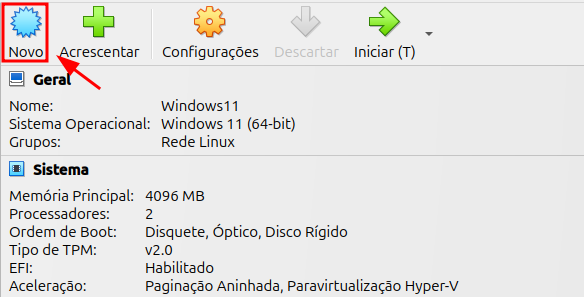

 

2. Nome e Sistema Opereacional
  - **Nome**: `Firewall`
  - **Image ISO**: Selecione o arquivo `.iso` do Debian   
  - **Tipo**: Linux
  - **Versão**: Debian (64‑bit)
  - **Pular Instalação Desassistida**: Marque

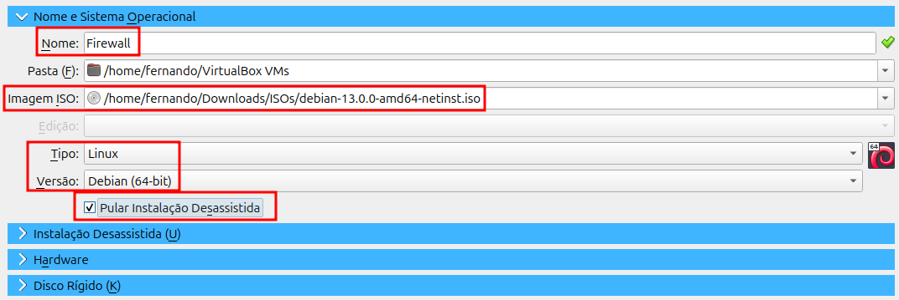

 

3. Hardware
  - **Memória Base**: `1024 MB`
  - **Processadores**: 1 CPU   
  - **Habilitar EFI**: Desmarque

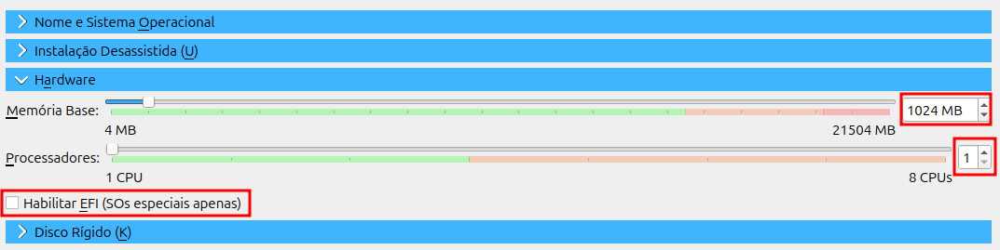

 

4. Disco Rígido
  - **Tamaho do Disco Virtual**: 15 GB

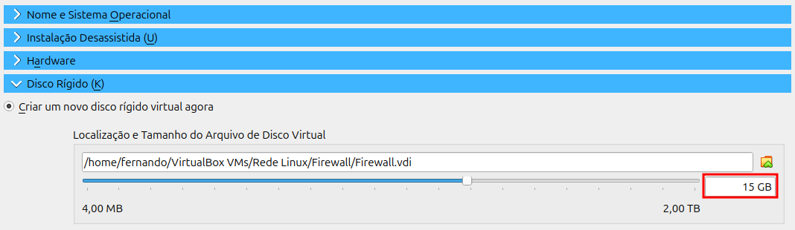

 

5. Clique em **Finalizar**

 

6. Configure as interfaces de rede

  - Na tela do VirtualBox, selecione a VM **Firewall** e clique em **Configurações**

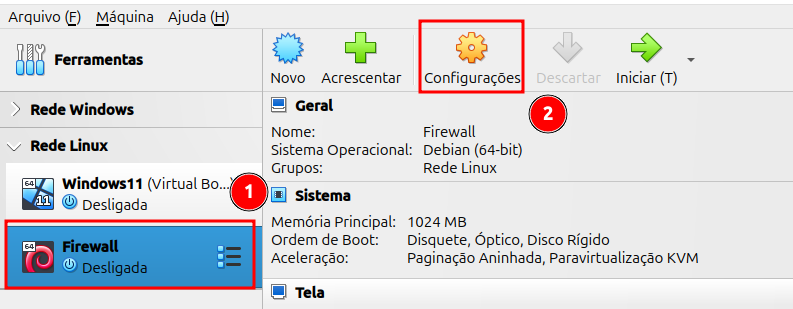

 

  - No menu lateral, clique em **Rede** e configure o `Adaptador 1` conforme está abaixo:
    - **Habilitar Placa de Rede**: Marque 
    - **Conectado a**: `NAT` ou `Placa em modo Bridge`

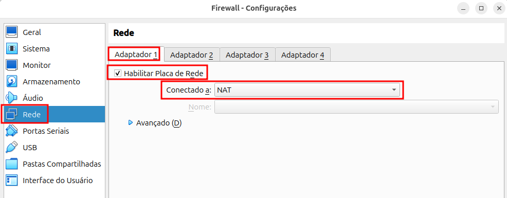

 

  - No menu lateral, clique em **Rede** e configure o `Adaptador 2` conforme está abaixo:
    - **Habilitar Placa de Rede**: Marque 
    - **Conectado a**: `Rede Interna`
    - **Nome**: `DMZ`

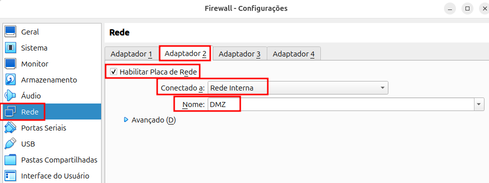

 

  - No menu lateral, clique em **Rede** e configure o `Adaptador 3` conforme está abaixo:
    - **Habilitar Placa de Rede**: Marque 
    - **Conectado a**: `Rede Interna`
    - **Nome**: `LanEmpresa`

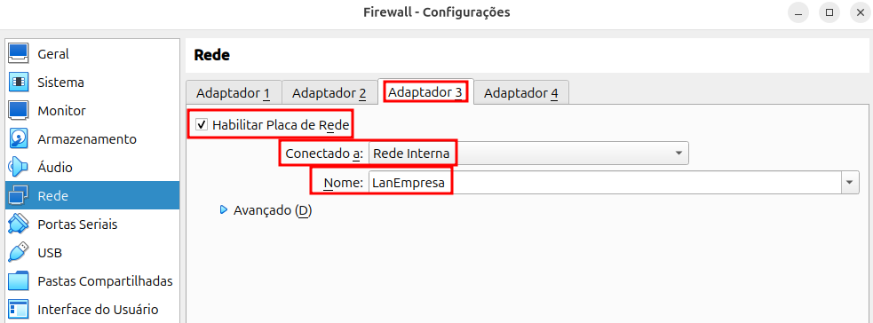

 

---

 

## 4) Instalação do Debian 13 

 

1. Iniciar a VM
  - Selecione a VM e clique **Firewall** em **Iniciar**

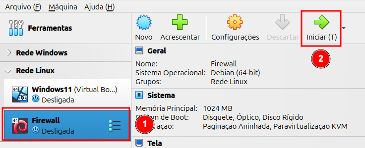

 

2. Menu de instalação do Debian
  - Selecione **Graphical Install**

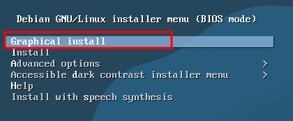

 

3. Select a language (Selecione um idioma)
  - **Language** (Idioma): `Portuguese (Brazil)`
  - Clique em **Continue**

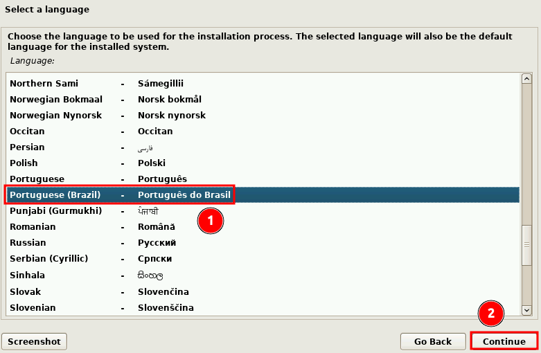

 

4. Selecionar sua localidade
  - **País, território ou área**: `Brasil`
  - Clique em **Continuar**

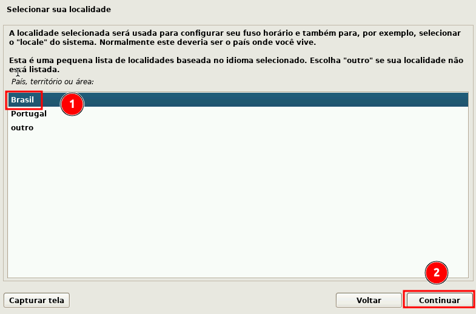

 

5. Configure o teclado
  - **Mapa do teclado a ser usado**: `Português Brasileiro`
  - Clique em **Continuar**

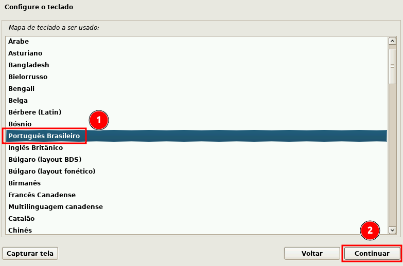

 

6. Configure a rede
  - **Nome de máquina**: `Firewall`
  - Clique em **Continuar**

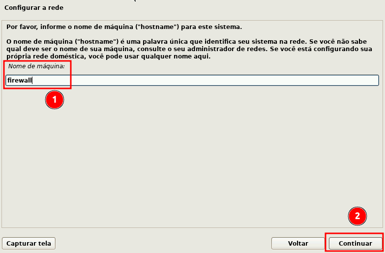

 

  - **Nome de domínio**: Deixe em branco
  - Clique em **Continuar**

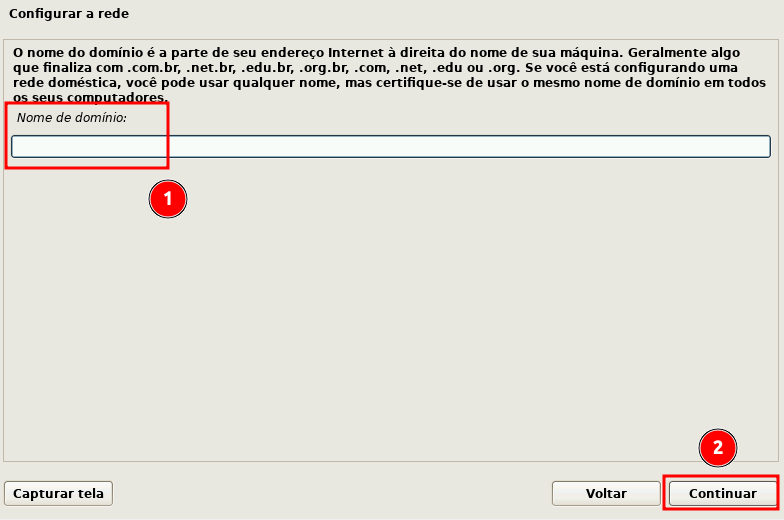

 

7. Configurar usuários e senhas
  - **Senha do root**: Deixe em branco
  - Clique em **Continuar**

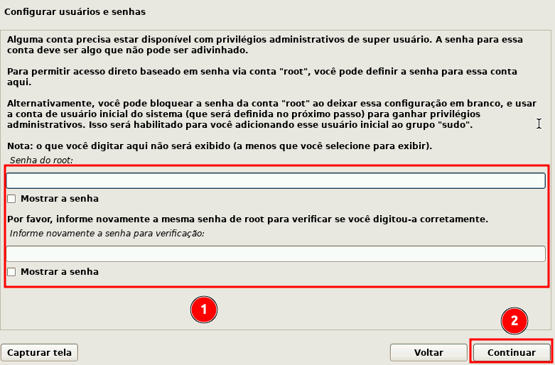

 

  - **Nome completo para o novo usuário**: `Usuario`
  - Clique em **Continuar**

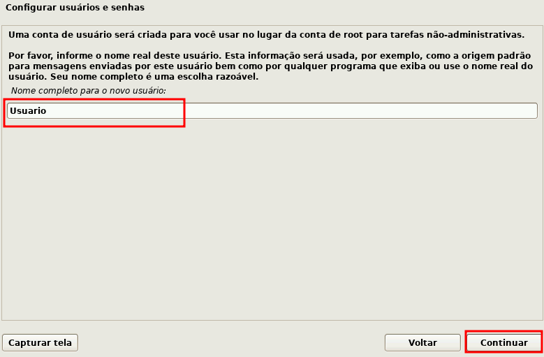

 

  - **Nome de usuário para sua conta**: `usuario`
  - Clique em **Continuar**

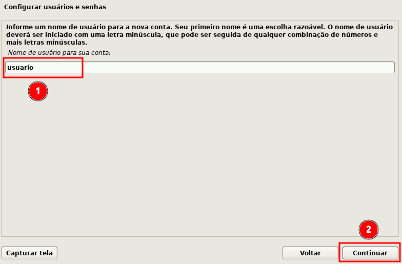

 

  - **Escolha uma senha para o novo usuário**: Digite uma senha forte
  - **Informe novamente a senha para verificação**: Digite novamente a senha
  - Clique em **Continuar**

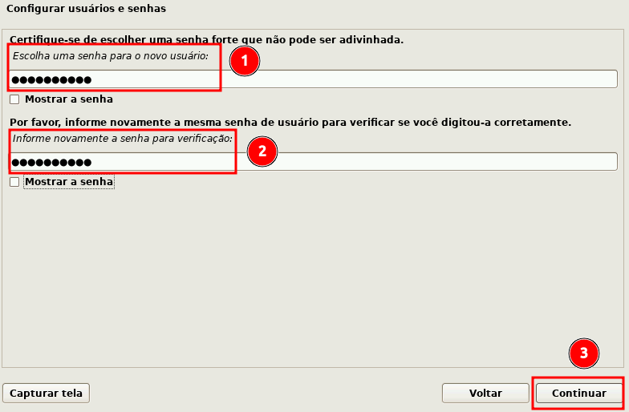

 

8. Configurar o relógio
  - **Selecione um estado ou província para definir o seu fuso horário**: Selecione o fuso horário de sua localidade.
  - Clique em **Continuar**

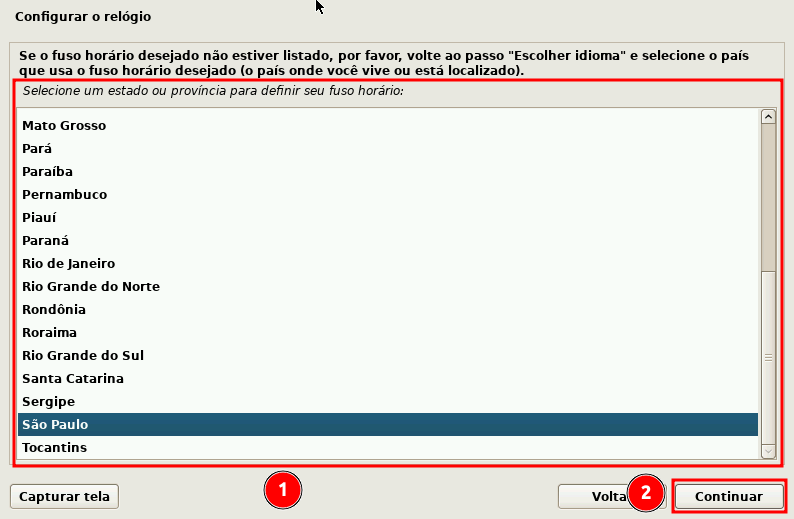

 

9. Particionar discos
  - **Método de particionamento**: `Assistido - usar o disco inteiro`
  - Clique em **Continuar**

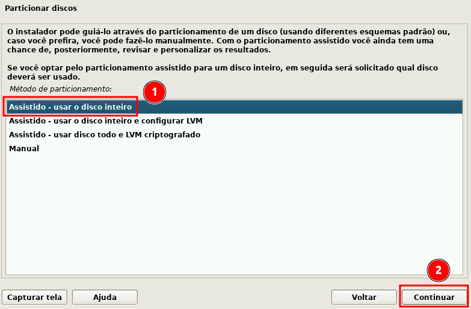

 

  - **Selecione o disco a ser particionado**: `SCCI3 (0,0,0)(sda) - 16.1 GB ATA VBOX HARDDISK`. O valor pode ser diferente deste, porém, só vai haver um disco. 
  - Clique em **Continuar**

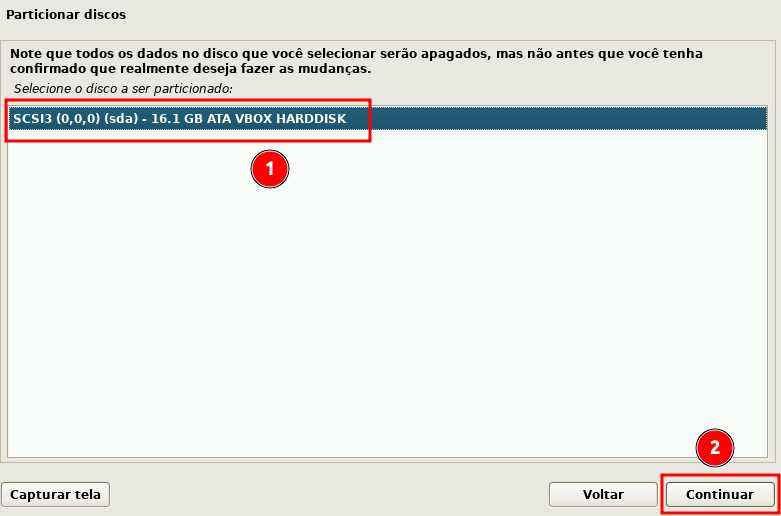

 

  - **Esquema de particionamento**: `Todos os arquivos em uma partição (para iniciantes)`
  - Clique em **Continuar**

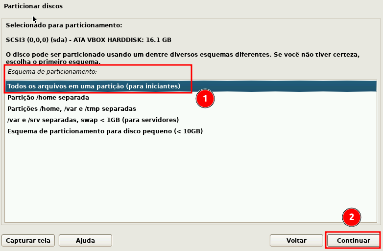

 

  - **Esta é uma visão geral de suas partições...**: `Finalizar o particionamento e escrever as mudanças no disco`
  - Clique em **Continuar**

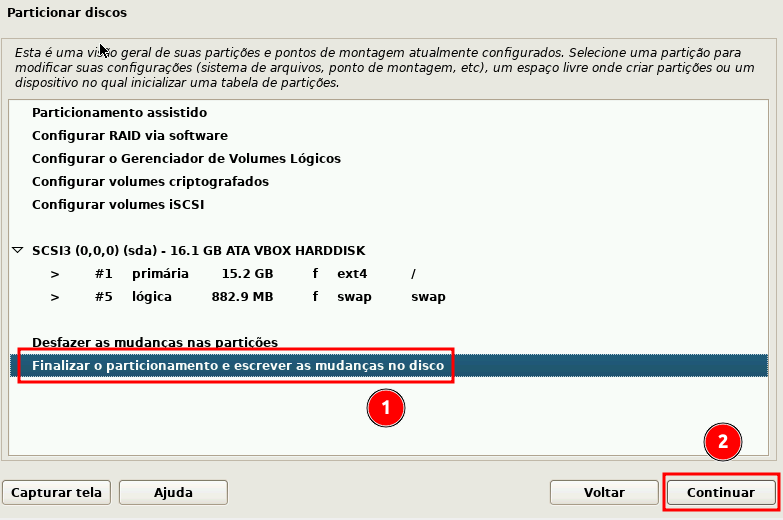

 

  - **Escrever as mudanças nos discos**: `Sim`
  - Clique em **Continuar**

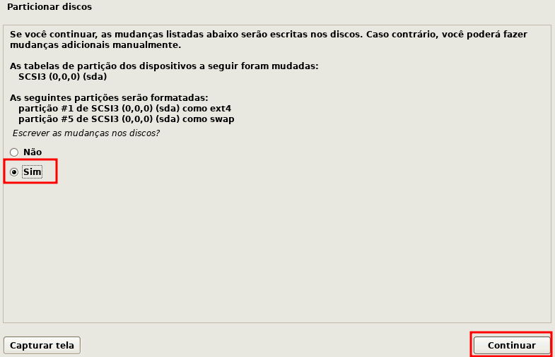

 

10. Configurar o gerenciador de pacotes
  - **Ler mídia de instalação adicional ?**: `Não`
  - Clique em **Continuar**

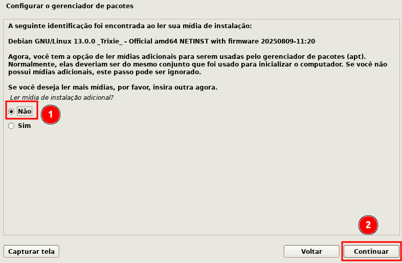

 

  - **País do espelho do repositório Debian**: `Brasil`
  - Clique em **Continuar**

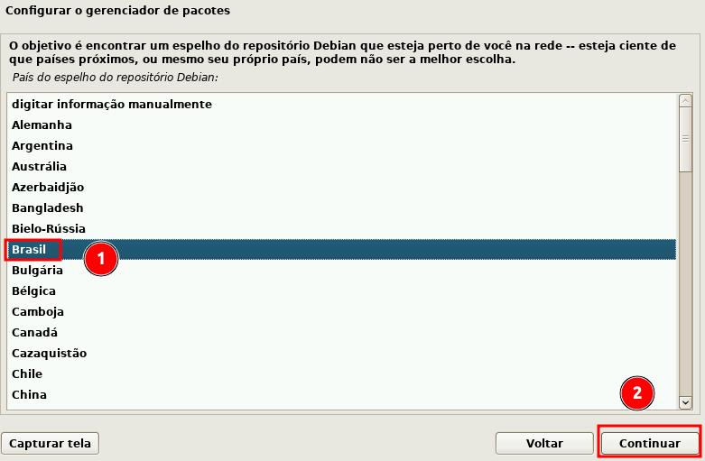

 

  - **Espelho do repositório Debian**: `deb.debian.org`
  - Clique em **Continuar**

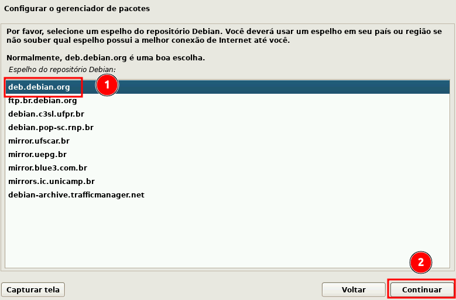

 

  - **Informação sobre proxy HTTP (deixe em branco para nenhum)**: Deixe em branco
  - Clique em **Continuar**

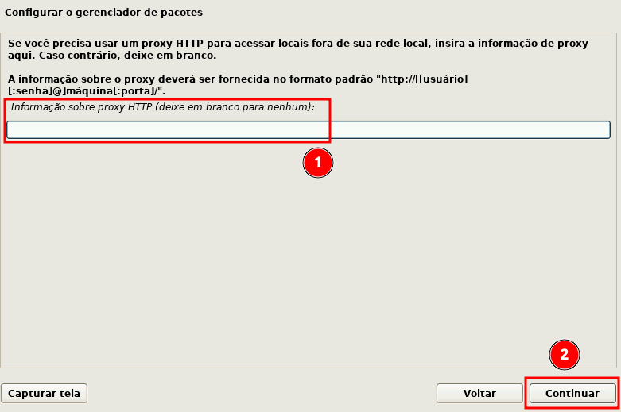

 

11. Configurando o popularity-contest
  - **Participar do concurso de utilização de pacotes ?**: `Não`
  - Clique em **Continuar**

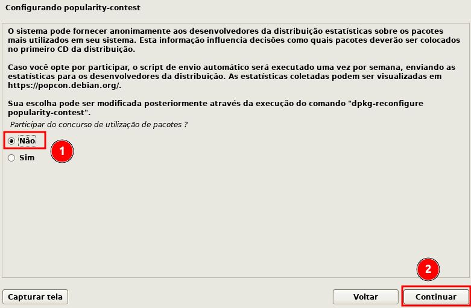

 

12. Seleção de software
  - **Escolha o software a ser instalado**: `servidor SSH` e `utilitários de sistema padrão`. Não use o `Enter` para selecionar, use a `Barra de espaco`. 
  - Clique em **Continuar**

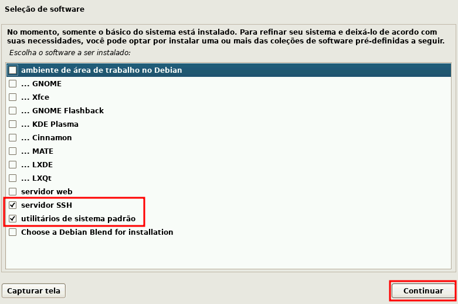

 

13. Instalar o carregador de inicialização GRUB
  - **Instalar o carregador de inicialização GRUB no seu disco primário?**: `Sim`
  - Clique em **Continuar**

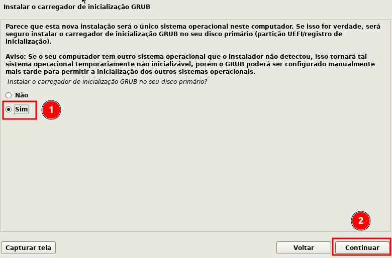

 

  - **Dispositivo no qual instalar o carregador de inicialização**: `/dev/sda (ata-VBOX HARDDISK_VBO647671-2719e3b9`. O valor pode ser diferente deste, porém, só vai haver um disco.
  - Clique em **Continuar**

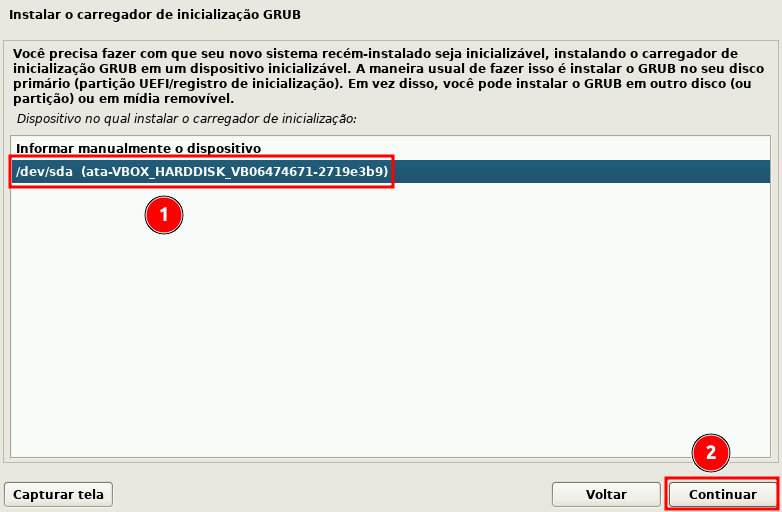

 

14. Finalizar a instalação
  - Remover a mídia de instalação:
    - No menu do VirtualBox clique em **Dispositivos** => **Discos Ópticos** => **Remover disco do drive virtual**. Se a última opção estiver apagada é porque o próprio VirtualBox já removeu o disco. 
  - Clique em **Continuar**

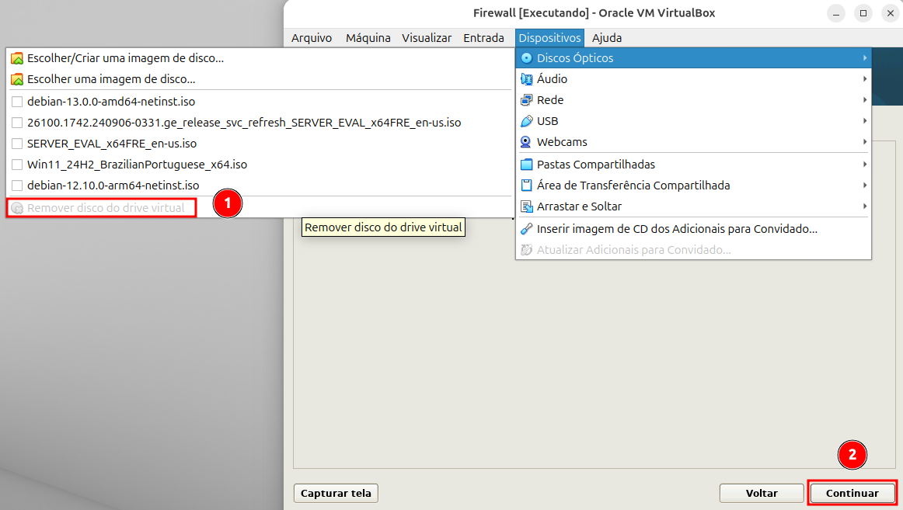

 

---