# Guia: Criar a VM do DHCP server com **Debian 13 (Trixie)** no VirtualBox

Este passo a passo mostra como criar a VM pelo assistente gráfico do VirtualBox para a tarefa proposta neste repositório.

<br/>

## 1) Baixar a ISO do Debian 13
- Acesse o site oficial do Debian e baixe a ISO [**amd64 netinst**](https://cdimage.debian.org/debian-cd/current/amd64/iso-cd/debian-13.1.0-amd64-netinst.iso). 
- Verifique o **checksum** (opcional, recomendado) para garantir a integridade da imagem.

<br/>

Salve a ISO, por exemplo, em:
- **Linux:** `~/ISO/Debian-13-netinst-amd64.iso`
- **Windows:** `C:\ISOs\Debian-13-netinst-amd64.iso`
- **macOS:** `~/Downloads/Debian-13-netinst-amd64.iso`

---

<br/>

## 2) Parâmetros sugeridos das VMs


| Componente | Valor sugerido | Observações |
|---|---|---|
| Nome | `dhcp01` | Use o mesmo nome do Hostname |
| Tipo/SO | Linux / Debian (64‑bit) | O VirtualBox detecta automaticamente pela ISO em versões mais novas |
| RAM | 1024 MB | 01 GB é suficiente para a nossa proposta |
| CPUs | 1 vCPU |  |
| Disco | 15 GB (VDI dinâmico) | Controladora SATA; VDI dinâmico economiza espaço |
| Vídeo | 16 MB, VMSVGA |  |
| Rede | Rede Interna "LAN_Empresa"| Para a rede LAN Empresa |

<br/>

> Os valores acima são sugeridos para o ambiente deste repositório. 

---

<br/>

## 3) Criar a VM pelo **Assistente Gráfico** (GUI)

<br/>

### 1. **Abrir o VirtualBox** → **Novo** (ou *Machine » New*).  

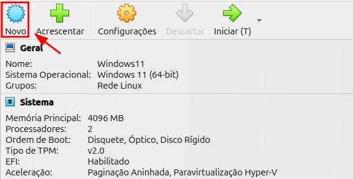

<br/>

### 2. Nome e Sistema Operacional

  - **Nome**: `Firewall`
  - **Image ISO**: Selecione o arquivo `.iso` do Debian   
  - **Tipo**: Linux
  - **Versão**: Debian (64‑bit)
  - **Pular Instalação Desassistida**: Marque

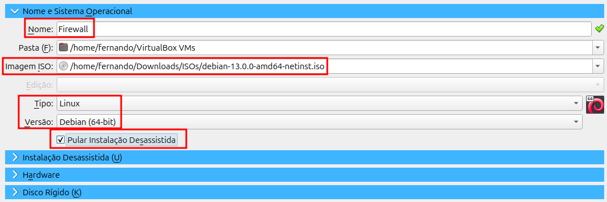

<br/>

### 3. Hardware
  - **Memória Base**: `1024 MB`
  - **Processadores**: 1 CPU   
  - **Habilitar EFI**: Desmarque


<br/>

### 4. Disco Rígido

  - **Tamaho do Disco Virtual**: 15 GB


<br/>

### 5. Clique em **Finalizar**

Nada demais, só clicar em `Finalizar` mesmo 🤷‍♂️.

<br/>

### 6. Configure as interfaces de rede

  - Na tela do VirtualBox, selecione a VM **Firewall** e clique em **Configurações**

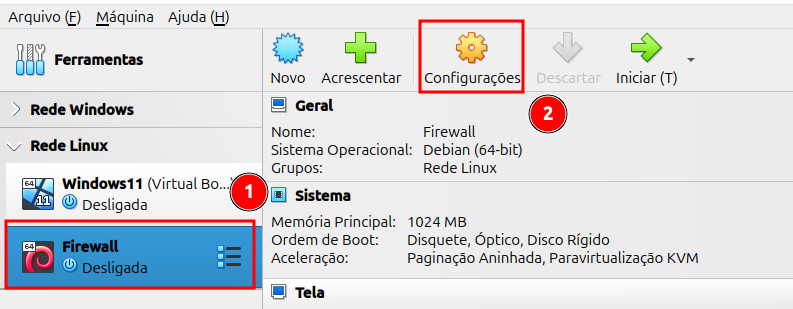

<br/>

  - No menu lateral, clique em **Rede** e configure o `Adaptador 1` conforme está abaixo:
    - **Habilitar Placa de Rede**: Marque 
    - **Conectado a**: `Placa em modo Bridge`

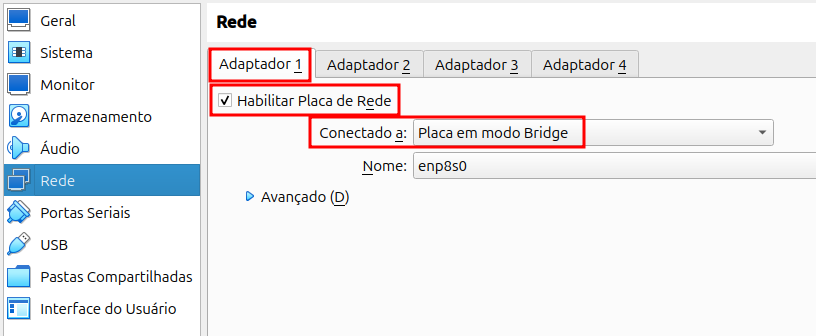

<br/>

  - No menu lateral, clique em **Rede** e configure o `Adaptador 2` conforme está abaixo:
    - **Habilitar Placa de Rede**: Marque 
    - **Conectado a**: `Rede Interna`
    - **Nome**: `DMZ`

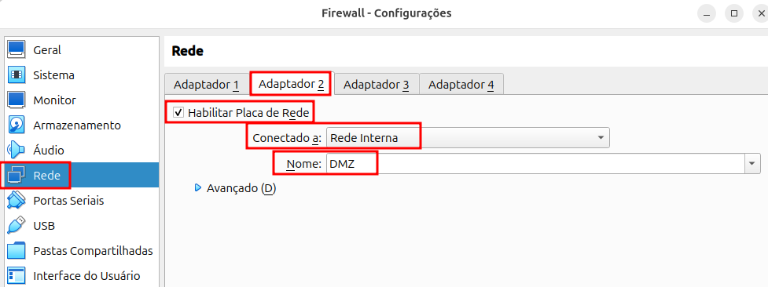

<br/>

  - No menu lateral, clique em **Rede** e configure o `Adaptador 3` conforme está abaixo:
    - **Habilitar Placa de Rede**: Marque 
    - **Conectado a**: `Rede Interna`
    - **Nome**: `LanEmpresa`

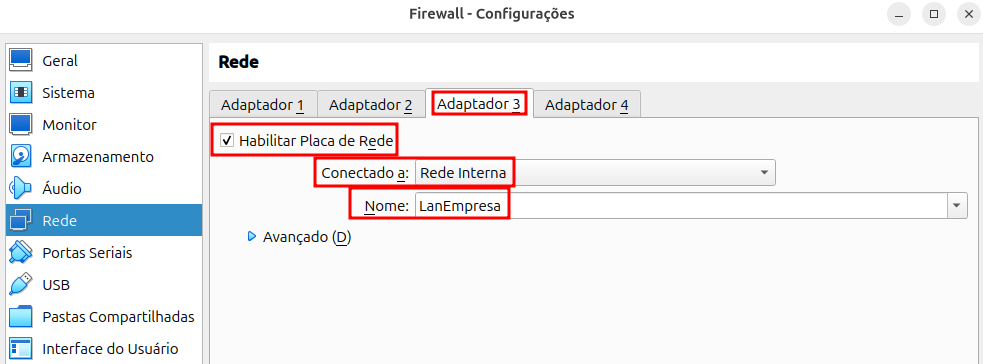

<br/>

---

<br/>

## 4) Instalação do Debian 13 

<br/>

### 1. Iniciar a VM
  - Selecione a VM e clique **Firewall** em **Iniciar**

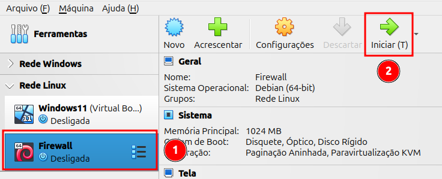

<br/>

### 2. Menu de instalação do Debian
  - Selecione **Graphical Install**

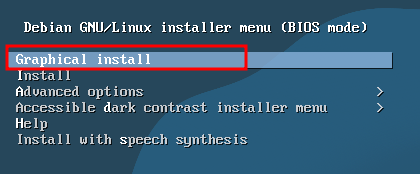

<br/>

### 3. Select a language (Selecione um idioma)

  - **Language** (Idioma): `Portuguese (Brazil)`
  - Clique em **Continue**


<br/>

### 4. Selecionar sua localidade
  - **País, território ou área**: `Brasil`
  - Clique em **Continuar**


<br/>

### 5. Configure o teclado
  - **Mapa do teclado a ser usado**: `Português Brasileiro`
  - Clique em **Continuar**

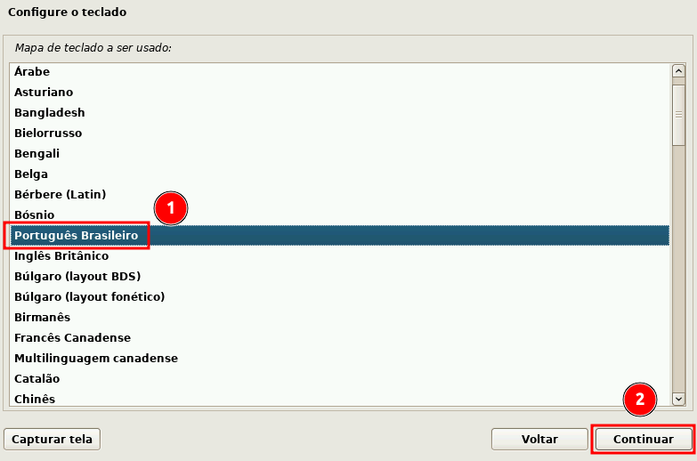

<br/>

### 6. Configure a rede
  - **Nome de máquina**: `Firewall`
  - Clique em **Continuar**

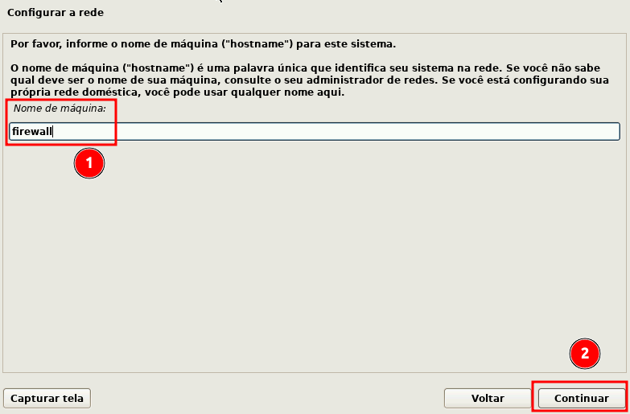

<br/>

  - **Nome de domínio**: Deixe em branco
  - Clique em **Continuar**


<br/>

### 7. Configurar usuários e senhas
  - **Senha do root**: Deixe em branco
  - Clique em **Continuar**

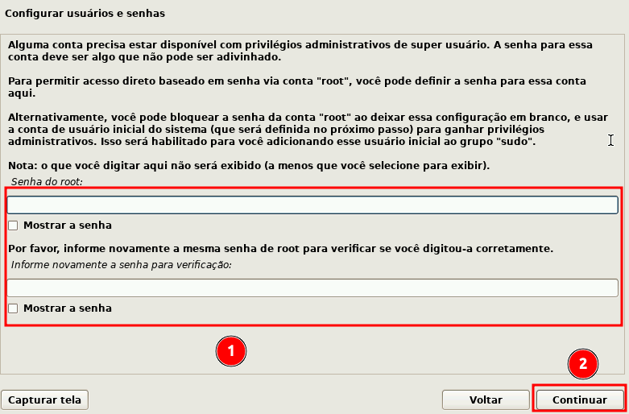

<br/>

  - **Nome completo para o novo usuário**: `Usuario`
  - Clique em **Continuar**

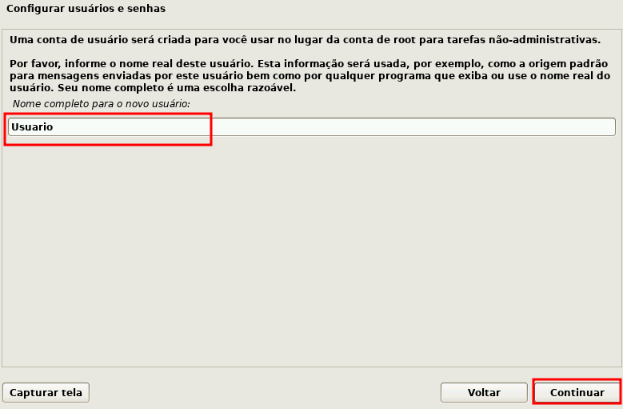

<br/>

  - **Nome de usuário para sua conta**: `usuario`
  - Clique em **Continuar**

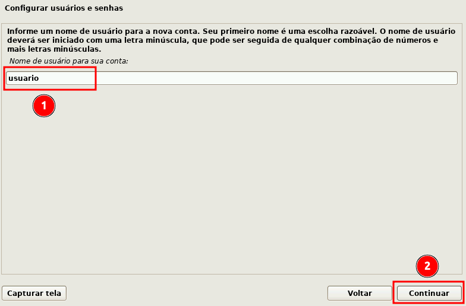

<br/>

  - **Escolha uma senha para o novo usuário**: Digite uma senha forte
  - **Informe novamente a senha para verificação**: Digite novamente a senha
  - Clique em **Continuar**

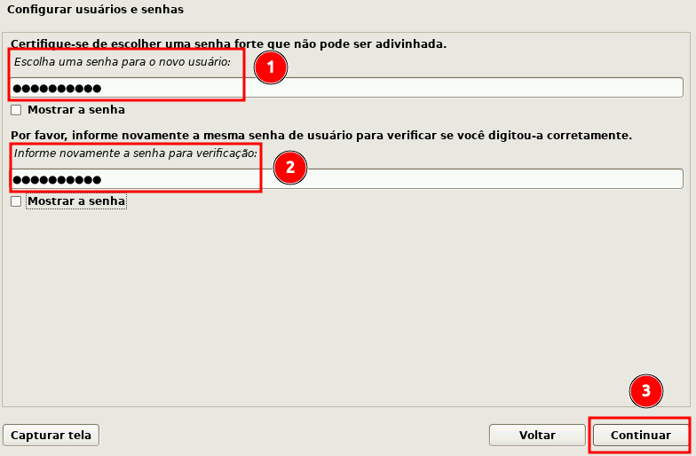

<br/>

### 8. Configurar o relógio
  - **Selecione um estado ou província para definir o seu fuso horário**: Selecione o fuso horário de sua localidade.
  - Clique em **Continuar**

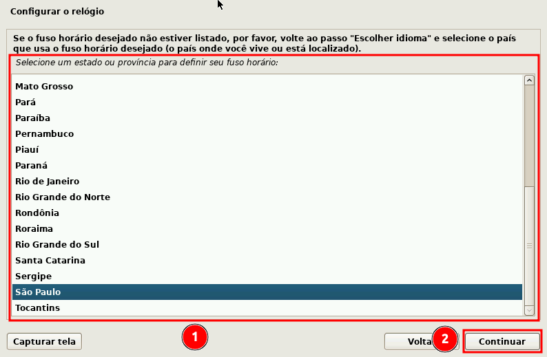

<br/>

### 9. Particionar discos
  - **Método de particionamento**: `Assistido - usar o disco inteiro`
  - Clique em **Continuar**

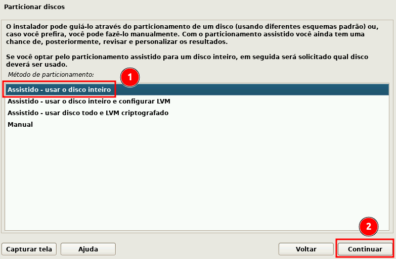

<br/>

  - **Selecione o disco a ser particionado**: `SCCI3 (0,0,0)(sda) - 16.1 GB ATA VBOX HARDDISK`. O valor pode ser diferente deste, porém, só vai haver um disco. 
  - Clique em **Continuar**


<br/>

  - **Esquema de particionamento**: `Todos os arquivos em uma partição (para iniciantes)`
  - Clique em **Continuar**

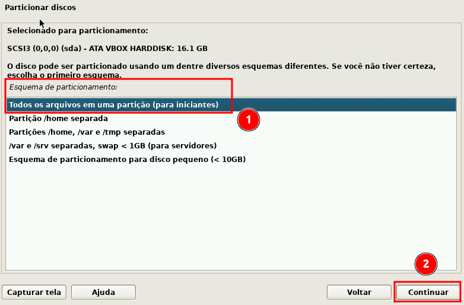

<br/>

  - **Esta é uma visão geral de suas partições...**: `Finalizar o particionamento e escrever as mudanças no disco`
  - Clique em **Continuar**

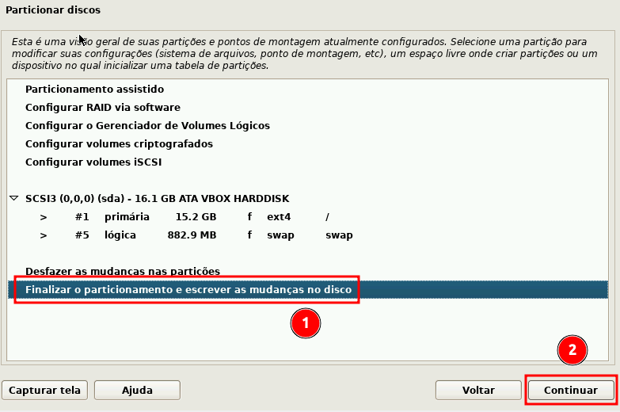

<br/>

  - **Escrever as mudanças nos discos**: `Sim`
  - Clique em **Continuar**

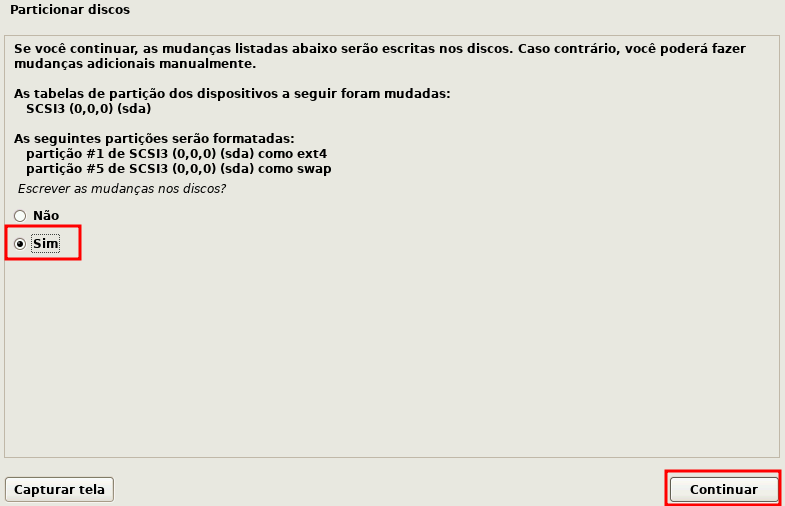

<br/>

### 10. Configurar o gerenciador de pacotes
  - **Ler mídia de instalação adicional ?**: `Não`
  - Clique em **Continuar**


<br/>

  - **País do espelho do repositório Debian**: `Brasil`
  - Clique em **Continuar**

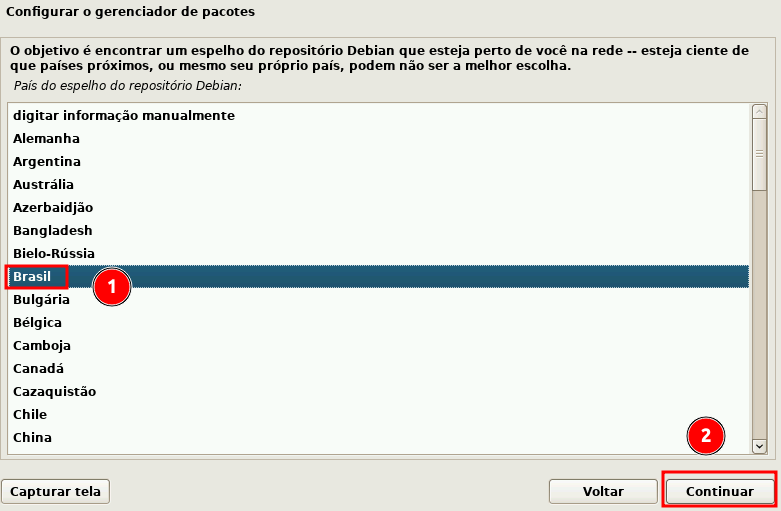

<br/>

  - **Espelho do repositório Debian**: `deb.debian.org`
  - Clique em **Continuar**

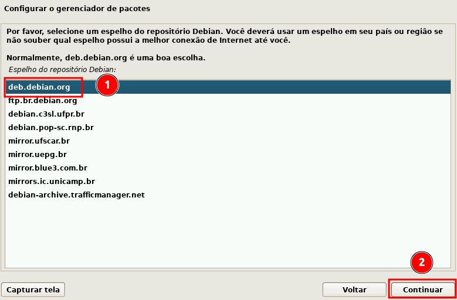

<br/>

  - **Informação sobre proxy HTTP (deixe em branco para nenhum)**: Deixe em branco
  - Clique em **Continuar**

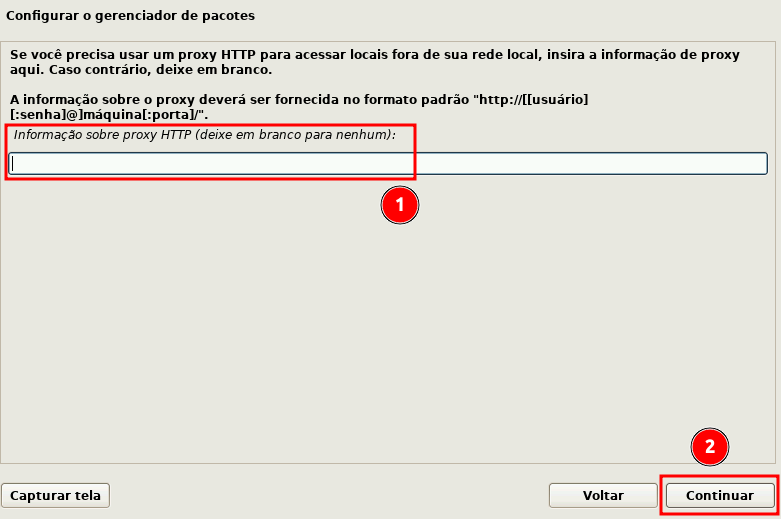

<br/>

### 11. Configurando o popularity-contest
  - **Participar do concurso de utilização de pacotes ?**: `Não`
  - Clique em **Continuar**


<br/>

### 12. Seleção de software
  - **Escolha o software a ser instalado**: `servidor SSH` e `utilitários de sistema padrão`. Não use o `Enter` para selecionar, use a `Barra de espaco`. 
  - Clique em **Continuar**

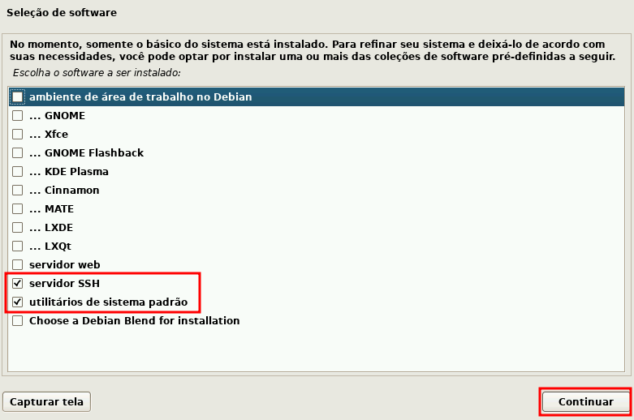

<br/>

### 13. Instalar o carregador de inicialização GRUB
  - **Instalar o carregador de inicialização GRUB no seu disco primário?**: `Sim`
  - Clique em **Continuar**

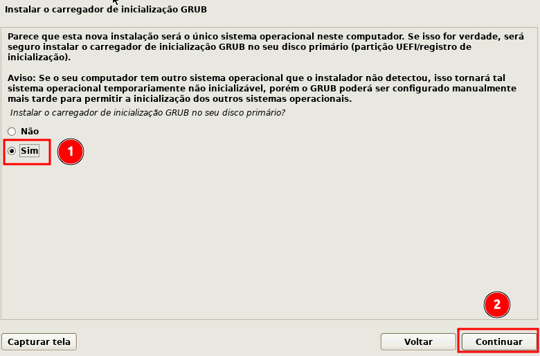

<br/>

  - **Dispositivo no qual instalar o carregador de inicialização**: `/dev/sda (ata-VBOX HARDDISK_VBO647671-2719e3b9`. O valor pode ser diferente deste, porém, só vai haver um disco.
  - Clique em **Continuar**

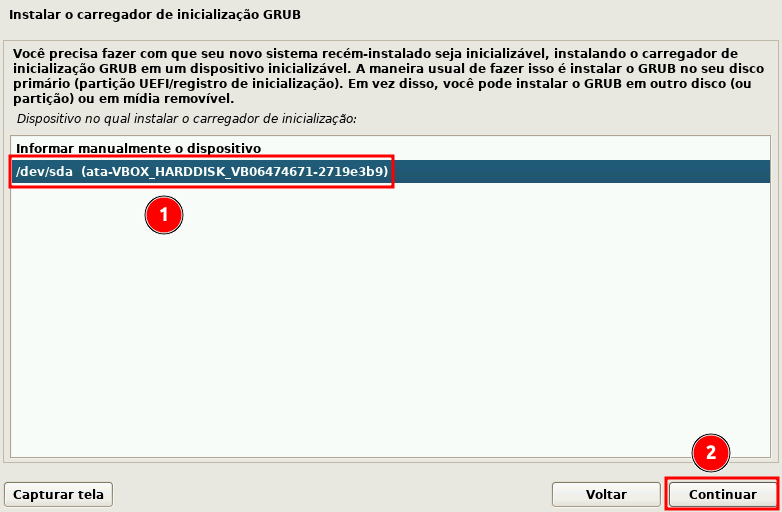

<br/>

### 14. Finalizar a instalação
  - Remover a mídia de instalação:
    - No menu do VirtualBox clique em **Dispositivos** => **Discos Ópticos** => **Remover disco do drive virtual**. Se a última opção estiver apagada é porque o próprio VirtualBox já removeu o disco. 
  - Clique em **Continuar**


---

<br/>

## 5) Configuração de rede

<br/>

### 1. Coletar os endereços MAC dos adaptadores de rede no VirtualBox:

<br/>

No VirtualBox, selecione a VM **Firewall**, clique em **Configurações** e, na janela que abrir, clique em **Rede** no menu lateral.  Relacione o adaptador ao endereço MAC, por exemplo:


<br/>

  - `Adaptador 1`
    - **Conectado a**: `Placa em modo Bridge`
    - **Endereço MAC**: `080027B70C24`

<br/>

  - `Adaptador 2`
    - **Conectado a**: `Rede Interna`
    - **Nome**: `DMZ`
    - **Endereço MAC**: `0800274F87C0`

<br/>

  - `Adaptador 3`
    - **Conectado a**: `Rede Interna`
    - **Nome**: `LanEmpresa`
    - **Endereço MAC**: `08002773FC47`

<br/>

### 2. Coletar os endereços MAC dos adaptadores de rede Debian:

<br/>

No shell do Debian, liste as interfaces de rede com o comando abaixo

```bash
ip -brief link
```

<br/>

A saída do comando:

```bash
lo               UNKNOWN        00:00:00:00:00:00 <LOOPBACK,UP,LOWER_UP> 
enp0s3           UP             08:00:27:b7:0c:24 <BROADCAST,MULTICAST,UP,LOWER_UP> 
enp0s8           DOWN           08:00:27:4f:87:c0 <BROADCAST,MULTICAST> 
enp0s9           DOWN           08:00:27:73:fc:47 <BROADCAST,MULTICAST> 
```

<br/>

### 3. Relacionar os interfaces de rede do Debian aos endereço MAC dos adaptadores de rede


Com os dados coleados acima, agora podemos relacionar os adaptadores de rede do VirtualBox com as interfaces de rede do Debian pelo endereço MAC. No meu caso ficará da seguinte forma:

<br/>

- **Adaptador 1**
  - **Conectado a**: `Placa em modo Bridge`
  - **Endereço MAC**: `080027B70C24`
  - **Interface**: `enp0s3`


<br/>

- **Adaptador 2**
  - **Conectado a**: `Rede Interna`
  - **Nome**: `DMZ`
  - **Endereço MAC**: `0800274F87C0`
  - **Interface**: `enp0s8`

<br/>

- **Adaptador 3**
  - **Conectado a**: `Rede Interna`
  - **Nome**: `LanEmpresa`
  - **Endereço MAC**: `08002773FC47`
  - **Interface**: `enp0s9`

<br/>

### 34. Configurar IPs no Debian  

<br/>

No shell do Debian, edite o arquivo `/etc/network/interfaces`

```bash
sudo nano /etc/network/interfaces
```

<br/>

Segue um exemplo de configuração das interfaces de rede. Se atente em atribuir corretamente os endereços IPs as interfaces de rede:

```bash
 This file describes the network interfaces available on your system
# and how to activate them. For more information, see interfaces(5).

source /etc/network/interfaces.d/*

# The loopback network interface
auto lo
iface lo inet loopback

# The primary network interface
allow-hotplug enp0s3
iface enp0s3 inet dhcp

# The secondary network interface
allow-hotplug enp0s8
iface enp0s8 inet static
  address	10.0.2.1
  netmask	255.255.255.0

# The tertiary network interface
allow-hotplug enp0s9
iface enp0s9 inet static
  address	10.0.3.1
  netmask	255.255.255.0
``` 

<br/>

Reinicie o serviço de rede

```bash
sudo systemctl restart networking
```

<br/>


Verifique a configuração

```bash
ip addr
```

<br/>


Verifique se tem conexão com a Internet

```bash
ping google.com
```

<br/>

## 6) Instalação básica de apps

<br/>

### 1. App básicos
  

```bash
sudo apt install -y curl vim 
``` 
---
