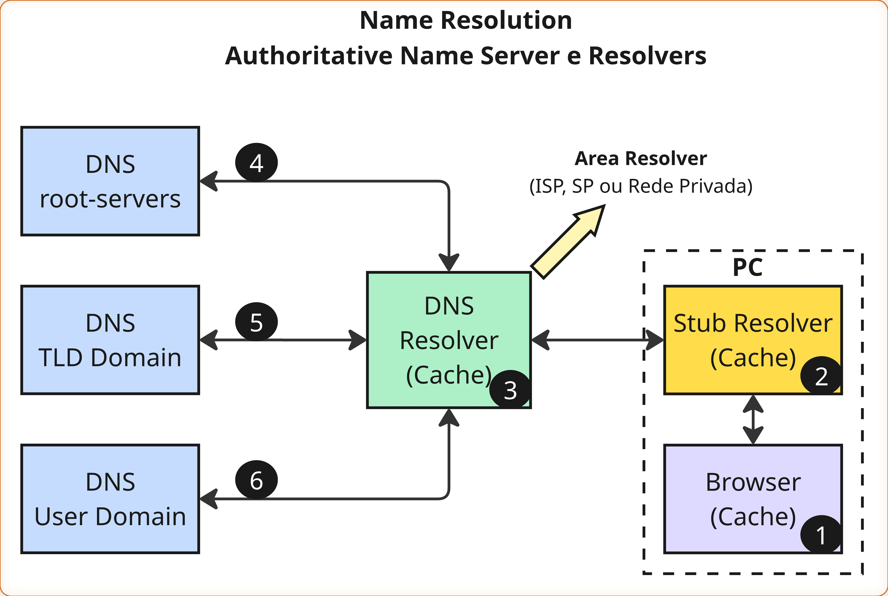

# DNS - Fundamentos

> Fontes: 
> - [BIND 9 Administrator Reference Manual](https://bind9.readthedocs.io/en/latest/#)
> - [DNS for Rocket Scientists](https://zytrax.com/books/dns/)

 

## O que é o DNS?

O **Domain Name Server** é um sistema distribuído e hierárquico usado para converter nomes legíveis por humanos em endereços IPs. Ele substituí o antigo arquivo *hosts*, que se tornou inviável à medida que a internet cresceu além de algumas centenas de máquina.

 

O DNS fornece:

- Uma estrutura hierárquica de nomes
- As regras de delegação de autoridade entre domínios
- A implementação de servidores que armazenam e respondem por essas informações
- Ele é organizado como um banco de dados distribuído em forma de árvore, onde cada nó possui um nome (label) e controla uma parte do espaço de nomes chamada domínio.

---

## Estrutura hierárquica do DNS

A árvore DNS é composta por níveis:
- **Raiz (.)**: o topo da hierarquia, representado por um ponto final.
- **TLDs (Top-Level Domains)**: como .com, .org, .net
- **ccTLDs (Country Code Top-Level Domain)**: domínios de código de país, como .br, .us, .uk
- **SLDs (Second-Level Domains)**: exemplo em exemplo.com
- **Subdomínios**: www.exemplo.com

> Um nome totalmente qualificado (FQDN) deve incluir o ponto final: `exemplo.com.`.

--- 

## Autoridade e Delegação

Cada domínio possui autoridade sobre sua parte da árvore. Essa autoridade pode ser delegada para subdomínios.

Exemplo:

- `.com` delega autoridade para `exemplo.com`
- `exemplo.com` pode delegar autoridade para `api.exemplo.com`

 

Cada domínio deve:

- Definir servidores **DNS autoritativos**
- Disponibilizar um **arquivo de zona** (zone file)
- Manter pelo menos **dois servidores DNS autoritativos** funcionando

---

## Servidores Raiz (Root Servers)

Existem 13 identificadores principais de servidores raiz (de A a M), como:

- `a.root-servers.net`
- `b.root-servers.net`
- etc.

Apesar de serem “13”, existem centenas de instâncias distribuídas pelo mundo, aumentando desempenho e redundância. Para mais informações acesse [root-servers.org](https://root-servers.org).

---

## Processo de Resolução de Nomes

Quando você acessa `www.exemplo.com`, ocorre o seguinte fluxo:

- O navegador (1) chama o **stub resolver** local (2).
- O stub resolver envia uma **consulta recursiva** ao resolvedor (3) (DNS do provedor, por exemplo).
- O resolvedor envia **consultas iterativas** à hierarquia DNS (4,5 e 6):
   - raiz → TLD → domínio → subdomínio
- O resultado é retornado ao usuário e **armazenado em cache** (2 e 1) para acelerar as próximas requisições.

---

## Tipos de Servidores DNS

### Servidor Autoritativo

Responde apenas por zonas que ele gerencia.
Tipos:

- **Primário (master)**: lê dados diretamente dos arquivos de zona.
- **Secundário (slave)**: recebe atualizações via zone transfer (AXFR ou IXFR).

 

### Resolver / Servidor Recursivo

Faz consultas a outros servidores para responder usuários finais.
Possui cache interno.

---

## Arquivos de Zona

Um arquivo de zona contém **Resource Records (RRs)**, como:

- **SOA**: informações de autoridade
- **NS**: servidores DNS autoritativos do domínio
- **A / AAAA**: mapeamento de nome para endereço
- **MX**: servidores de email
- **CNAME**: alias

--- 

## Segurança no DNS

### DNSSEC

Garante:

- Autenticidade
- Integridade
- Não falsificação

Usa:

- Assinaturas digitais
- Cadeias de confiança

 

### TSIG / SIG(0)

Protege:

- Transferências de zona
- Atualizações dinâmicas (nsupdate)

 

### DNS-over-TLS (DoT)

Protege tráfego entre resolvers e servidores recursivos.

--- 

## Glossário

- **Autoridade**: Responsabilidade sobre uma zona. Indica que o servidor é confiável para responder sobre aquele domínio.   

- **Autoritativo**: Servidor que possui e serve dados oficiais de uma zona.

- **BIND 9**: Implementação mais usada de DNS na Internet.

- **Cache**: Armazenamento temporário de respostas DNS paraStub Resolver acelerar consultas futuras.

- **ccTLD**: Domínio de topo de país (.br, .us).

- **Delegação**: Passar autoridade de um domínio para outro. Ex.: `.com` delega `empresa.com`.

- **DNSSEC**: Extensão que adiciona assinaturas digitais para garantir autenticidade dos dados DNS.

- **FQDN**: Nome de domínio totalmente qualificado, incluindo o ponto final.Ex.: `www.exemplo.com.`.

- **[ICANN](https://www.icann.org/)**: ICANN é uma corporação sem fins lucrativos de benefício público com participantes de todo o mundo dedicados a manter a Internet segura, estável e interoperável. Promove a concorrência e desenvolve políticas sobre identificadores exclusivos da Internet. Através do seu papel de coordenação do sistema de nomenclatura da Internet, tem um impacto importante na expansão e evolução da Internet. 

- **Iterativa (consulta)**: O servidor responde com a melhor informação que possui.

- **Recursiva (consulta)**: O servidor deve retornar a resposta final, buscando em outros servidores.
  
- **Resolver**: Servidor que processa consultas recursivas para usuários.

- **Root Servers**: Servidores raiz da Internet, início da resolução DNS.

- **SOA Record**: Primeiro registro da zona; contém informações como serial, tempo de expiração, etc.

- **Stub Resolver**: Implementação mínima usada por sistemas operacionais para enviar consultas ao DNS recursivo.

- **TSIG**: Assinatura baseada em chave compartilhada para proteger transferências e atualizações.

- **Zone File**: Arquivo contendo registros (RRs) que definem os dados de uma zona DNS.

- **Zone Transfer**: Sincronização de uma zona entre servidor primário e secundário (AXFR/IXFR).