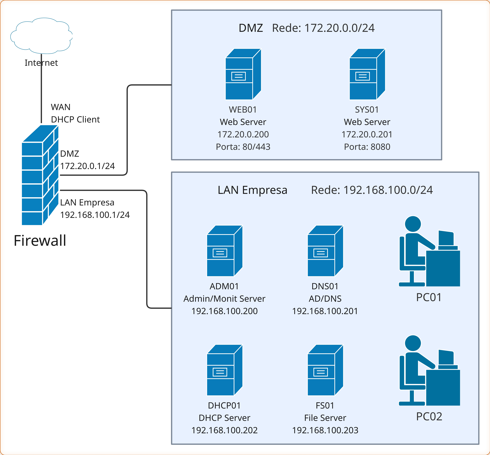

# 🏢 Laboratório de Infraestrutura Corporativa com Debian 13

Bem-vindo ao guia passo a passo para a construção de uma infraestrutura de TI corporativa completa utilizando **Debian 13 "Trixie"**.

Este projeto foi desenhado para **iniciantes**. O objetivo não é apenas digitar comandos, mas entender como os servidores conversam entre si, como proteger uma rede e como gerenciar usuários em um ambiente profissional.

## 🗺️ Topologia de Rede

O nosso laboratório simula uma empresa real com segmentação de rede para segurança.

| Zona | Sub-rede | Descrição |
| :--- | :--- | :--- |
| **WAN** | DHCP (ISP) | Conexão com a Internet (via NAT do VirtualBox) |
| **DMZ** | `172.20.0.0/24` | Zona Desmilitarizada (Serviços acessíveis de fora) |
| **LAN** | `192.168.100.0/24` | Rede Local (Servidores internos e Estações) |

## 🖥️ Inventário de Servidores

| Hostname | IP | Função | Software Principal |
| :--- | :--- | :--- | :--- |
| **FIREWALL** | **WAN**: DHCP Client | Gateway, Firewall, Roteamento | Nftables, Chrony |
| | **DMZ**: 172.20.0.1 | | |
| | **LAN**: 192.168.100.1 | |  |
| **DC01** | 192.168.100.200 | Controlador de Domínio Primário, DNS | Samba4 AD, Bind9 (interno) |
| **DC02** | 192.168.100.201 | Controlador de Domínio Secundário | Samba4 AD |
| **DHCP01** | 192.168.100.202 | Servidor de DHCP | ISC Kea DHCP4 |
| **FS01** | 192.168.100.203 | Servidor de Arquivos | Samba4 File Server |
| **WEB01** | 172.20.0.200 | Servidor Web (Intranet/Extranet) | Nginx |
| **SYS01** | 172.20.0.201 | Sistema Interno | App Customizada (:8080) |

## 👥 Estrutura de Usuários e Grupos

Neste laboratório, vamos gerenciar a autenticação centralizada. Estes são os funcionários da nossa empresa fictícia:

### 1. Departamento Financeiro (`grp_financeiro`)

* Ana Souza (`ana.souza`)
* Bruno Alves (`bruno.alves`)
* Carla Dias (`carla.dias`)

### 2. Recursos Humanos (`grp_rh`)

* Daniel Rocha (`daniel.rocha`)
* Elisa Martins (`elisa.martins`)
* Fabio Costa (`fabio.costa`)

### 3. Tecnologia / TI (`grp_ti`)

* Gabriel Lima (`gabriel.lima`)
* Helena Silva (`helena.silva`)
* Igor Santos (`igor.santos`)
* Julia Pereira (`julia.pereira`)

---

## 🛠️ Pré-requisitos

* Computador com suporte a virtualização (VT-x/AMD-V).
* VirtualBox ou KVM/QEMU instalado.
* ISO do **Debian 13 (Trixie)** Netinst.
* Vontade de aprender!

## 📚 Como usar este guia

Siga os documentos na ordem numérica abaixo. Cada guia contém a explicação teórica seguida da prática.

1. [Firewall.md](./1.Firewall/Firewall.md) - *Onde tudo começa.*
2. [Controlador_DC01.md](./2.DC01/Controlador_DC01.md) - *A base da identidade.*
3. [Servico_DHCP01.md](./3.DHCP01/Servico_DHCP01.md) - *Automação de IPs.*
4. [Controlador_DC02.md](./2.DC01/Controlador_DC02.md) - *A base da identidade secundária.*
5. [FS01.md](./docs/FS01.md) - *Compartilhamento seguro.*