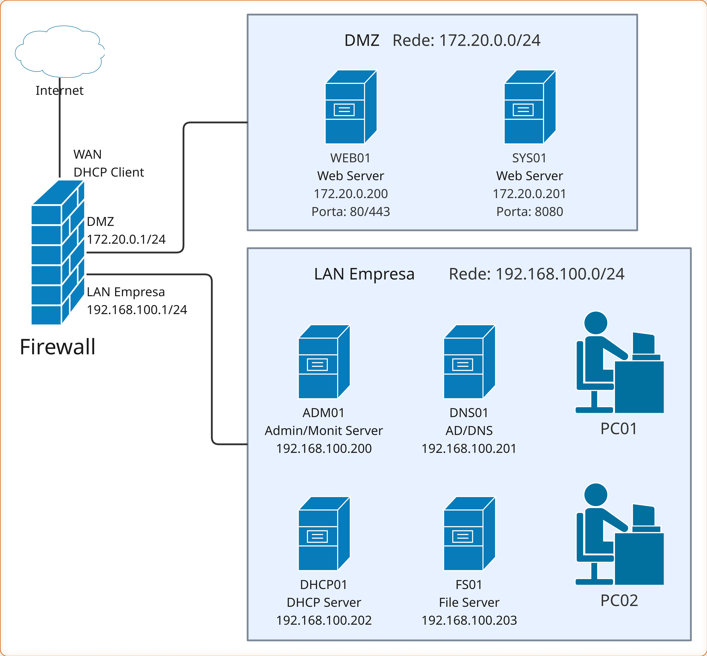

# 🖥️ UC07 – Planejar e Executar a Instalação, Configuração e Monitoramento de Servidores

<br/>

Repositório de apoio às aulas da **UC07** dos cursos **Técnico em Manutenção e Suporte em Informática**, **Técnico em Informática** e **Técnico em Redes** (UC03).  

Este repositório contém **scripts, arquivos de configuração, guias e exemplos práticos** utilizados nas aulas para o desenvolvimento das competências ligadas à **administração de sistemas operacionais de rede (servidores)** em ambientes locais e virtualizados.

---

<br/>

## 🌐 Topologia da Infraestrutura

A arquitetura de rede utilizada nos laboratórios da UC07 é composta por três zonas principais: **WAN**, **DMZ** e **LAN (Clientes)**, separadas por um **firewall** configurado com **nftables**.



### 🔹 Descrição da Topologia

| Zona | Equipamento | Função | Endereço IP |
|------|--------------|--------|-------------|
| **WAN** | Firewall | Conexão com a Internet | `10.0.1.2` |
| **DMZ (10.0.2.0/24)** | DMZ01 | Servidor **DNS** | `10.0.2.2` |
| | DMZ02 | Servidor **Web (Nginx)** | `10.0.2.3` |
| **LAN Clientes (10.0.3.0/24)** | SRV01 | Servidor **DHCP** – range `10.0.3.11-99` | `10.0.3.100` |
| | SRV02 | Servidor **File Server (Samba)** | `10.0.3.101` |
| | SRV03 | Servidor **LDAP** | `10.0.3.102` |
| | PC01 | Estação Cliente | IP dinâmico (DHCP) |
| **Firewall** | nftables | Encaminhamento, NAT e controle de acesso entre zonas | `10.0.2.1 / 10.0.3.1` |

---

<br/>

## 🎯 Objetivo da UC
Capacitar o estudante para **planejar, instalar, configurar e monitorar sistemas operacionais de rede**, garantindo a segurança, o desempenho e a disponibilidade dos serviços.

---

<br/>

## 🧩 Competência
Planejar e executar a instalação, a configuração e o monitoramento de sistemas operacionais de redes locais (servidores).

---

<br/>

## 📊 Indicadores de Desempenho
- Instala sistemas operacionais em servidores conforme normas técnicas e políticas de segurança.  
- Configura e gerencia serviços de rede (DNS, DHCP, Web, LDAP, Firewall).  
- Monitora servidores e serviços, aplicando técnicas de diagnóstico e resolução de problemas.  
- Registra e documenta configurações e intervenções realizadas.  

---

<br/>

## 🧠 Temas Principais

| Tema | Descrição |
|------|------------|
| **Administração de Servidores Linux** | Instalação, configuração e hardening de sistemas Debian/Ubuntu. |
| **Serviços de Rede** | DNS, DHCP, HTTP/HTTPS, Proxy, NTP, SSH, FTP, Samba. |
| **Gerência de Usuários e Domínios** | Criação de usuários, grupos, permissões e autenticação centralizada via **LDAP**. |
| **Firewall e Segurança** | Controle de tráfego com **nftables** e análise de logs. |
| **Monitoramento de Recursos** | Instalação e uso de ferramentas como **Zabbix Agent**, **htop**, **ss**, **journalctl** e **systemd-analyze**. |
| **Virtualização e Testes** | Uso de **VirtualBox** e **Hyper-V** para simular servidores e redes locais. |

---

<br/>

## 🧪 Laboratórios Práticos

| Serviço | Objetivo | Ferramentas |
|----------|-----------|-------------|
| **DNS (BIND9)** | Criar e gerenciar zonas de resolução direta e reversa. | `named.conf`, `dig`, `nslookup` |
| **DHCP (Kea / ISC)** | Automatizar a atribuição de endereços IP e reservas fixas. | `kea-dhcp4`, `dhcpd.conf` |
| **Firewall (nftables)** | Controlar acesso entre as zonas LAN/DMZ/WAN e registrar logs. | `nft`, `/etc/nftables.conf` |
| **Servidor Web (Nginx)** | Hospedar sites internos e testar a comunicação entre sub-redes. | `Nginx`, `curl` |
| **LDAP (slapd)** | Gerenciar autenticação centralizada de usuários em rede. | `ldapadd`, `slapcat`, `ldif` |
| **Monitoramento (Zabbix Agent)** | Acompanhar desempenho e disponibilidade dos serviços. | `zabbix-agent`, `ps`, `ss` |

---

<br/>

## 🧰 Estrutura do Repositório

```bash
UC07-Servidores/
├── README.md
├── diag_rede_linux.jpg
│
├── dns/
│   ├── README.md
│   ├── scripts/
│   │   └── instalar_dns.sh
│   └── configs/
│       └── named.conf.local
│
├── dhcp/
│   ├── README.md
│   ├── scripts/
│   │   └── configurar_dhcp.sh
│   └── configs/
│       └── dhcpd.conf
│
├── firewall/
│   ├── README.md
│   ├── scripts/
│   │   └── configurar_firewall_nftables.sh
│   └── configs/
│       └── nftables.conf
│
├── ldap/
│   ├── README.md
│   ├── scripts/
│   │   └── configurar_ldap.sh
│   └── configs/
│       └── slapd.ldif
│
├── webserver/
│   ├── README.md
│   └── configs/
│       └── nginx.conf
│
├── monitoramento/
│   ├── scripts/
│   │   └── monitoramento_zabbix.sh
│   └── docs/
│       └── guia_monitoramento.md
│
└── docs/
    ├── guia_pratico_nftables.md
    ├── guia_dns_dhcp.md
    ├── guia_ldap.md
    └── guia_monitoramento.md
```

---

<br/>

## 🧾 Recursos Utilizados em Aula
- **Distribuição base:** Debian 13 (Trixie)  
- **Ferramentas de virtualização:** VirtualBox / Hyper-V  
- **Monitoramento:** Zabbix Server + Agent  
- **Editor de texto:** Nano / Vim  

---

<br/>

## 👨‍🏫 Docente Responsável
**Fernando Dias**  
Docente da área de Redes e Infraestrutura

---

<br/>

## 🤝 Contribuições
Os alunos podem:
- Propor melhorias nos scripts e arquivos de configuração;  
- Corrigir erros encontrados durante os testes;  
- Adicionar documentação complementar de boas práticas.  

---

<br/>

## 🏁 Licença
Material de uso **educacional**.  
Distribuído sob a licença **Creative Commons CC BY-NC-SA 4.0** – uso não comercial e compartilhamento com atribuição.

---
